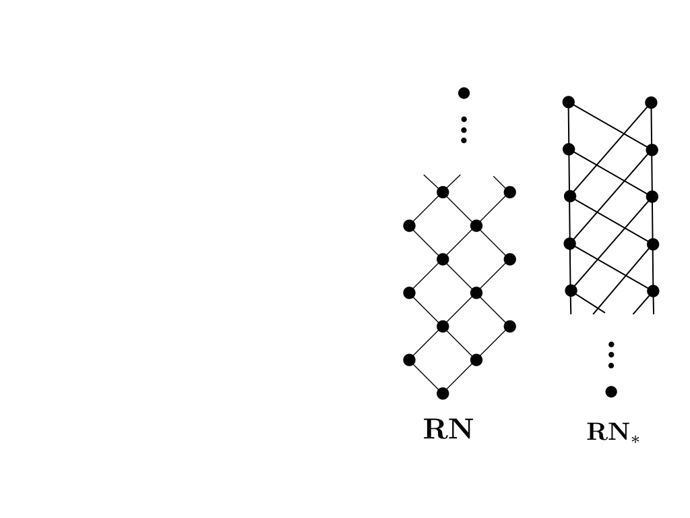
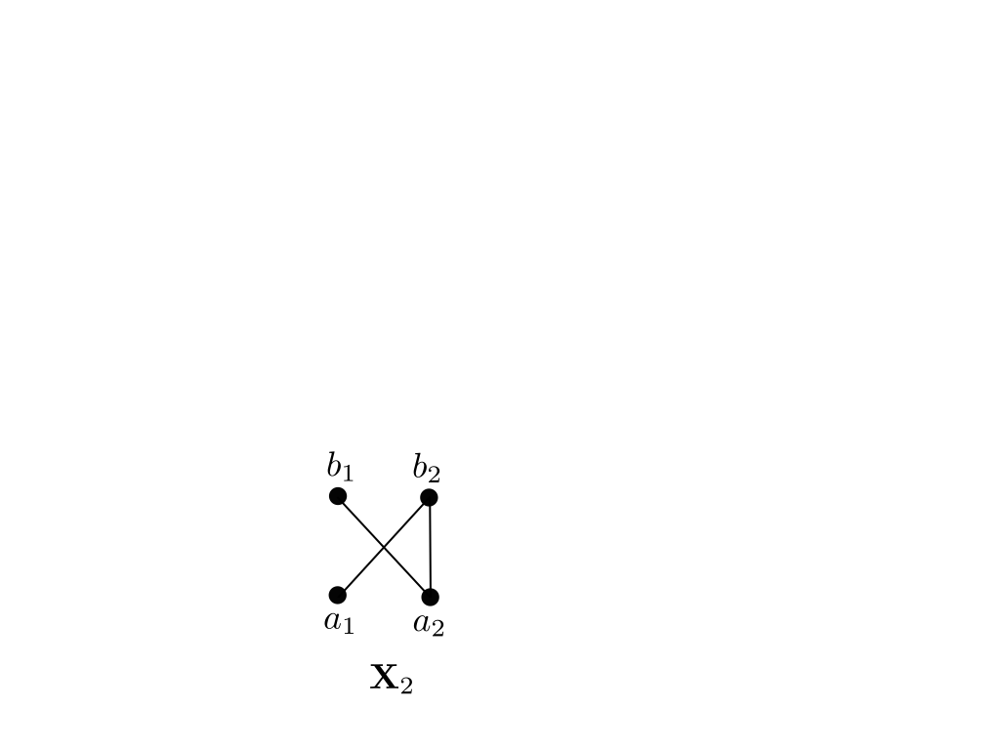
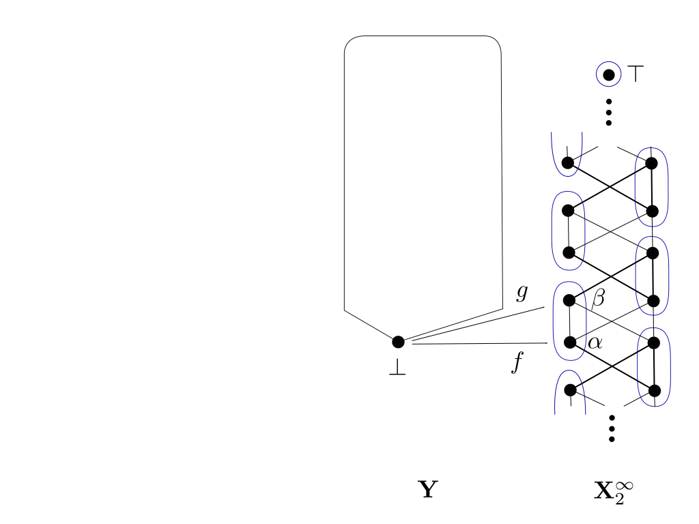
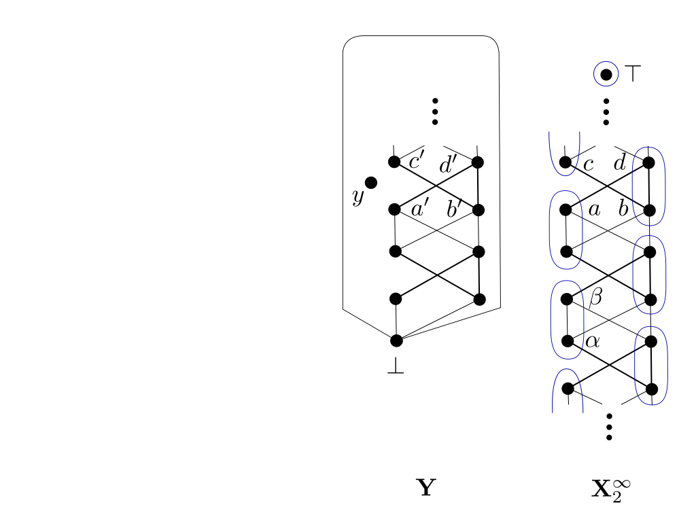

---
author:
- J. J. Wannenburg
institute: 
- 'Institute of Computer Science, Academy of Sciences of the Czech Republic, Czech Republic'
title: 'Title'
subtitle: 'Conference Name'
date: 'Date'
titlegraphic: 'images/EUHorisontal.jpg'
thanks: 'This work was carried out within the project *Supporting the internationalization of the Institute of Computer Science of the Czech Academy of Sciences* (no.\ CZ.02.2.69/0.0/0.0/18\_053/0017594), funded by the Operational Programme Research, Development and Education of the Ministry of Education, Youth and Sports of the Czech Republic. The project is co-funded by the EU.'
...

# Test Animation {data-x="1024" data-y="-768" data-scale="1"}

When you arrive at the slide, 

the animation is triggered

(unless you are in beamer)

* This is an itemized list
* To the right is a lattice

1) This is an enumerated list
2) Use arrows to move between slides
3) You can see the previous slide from the next slide

::: notes
Some notes in *markdown*.

One can create new lines as above to create space.

Slides start at the title of # symbol and end at the dashes.

Note that beamer does not play the animation.
:::

---------------------------------

# Environments {data-x="1024" data-y="-250" data-scale="1"}

Thm
:    In the join of the six covers of $\overline{\mathbf{C_4}}$ within $\mathsf{M}$, every subquasivariety is a variety.
\
\

$p, p \to q \vdash_{\mathbf{R^t}} q$
:   Suppose that $e \leq p$ and $e \leq p \to q$. By the law of residuation $p \leq q$, then $e \leq q$, by the transitivity of $\leq$.
\
\

## Thm

An alternative that goes with a proof

### Proof

It is self evident.

------------------

# This slide has columns {data-x="1024" data-y="100" data-scale="1"}

::: columns

:::: column
left
::::

:::: column
right
::::

:::

-------------------

# Using full-slide and columns {.full-slide data-x="1024" data-y="500" data-scale="1"}

::: columns

:::: column
Recall that the Rieger-Nishimura lattice $\mathbf{RN}$ is the one-generated free Heyting algebra depicted below.
::::

:::: column

::::

:::

-------------------

# Disappearing images {.full-slide data-x="1024" data-y="1200" data-scale="1"}

{.disappear}

---------------------------------

# {.full-slide .unselectable data-x="1024" data-y="1200" data-scale="1"}

{.disappear}

---------------------------------

# {.full-slide .unselectable data-x="1024" data-y="1200" data-scale="1"}

---------------------------------

# Fixed image {.full-slide data-x="2050" data-y="-700" data-scale="1"}

::: columns

:::: column
Keeping a 'fixed' floating image.

Suppose this is a long proof.

And I want to keep the picture around as I continue with the proof.
::::

:::: column

::::

:::

{.disappear .fixed}

---------------------------------

# {.full-slide data-x="2050" data-y="-550" data-scale="1"}

::: columns

:::: column

\
\
\
\

And do one more step.

And do one more step.

And do one more step.

::::

:::: column

::::

:::

{.disappear .fixed}

---------------------------------

# {.full-slide data-x="2050" data-y="-450" data-scale="1"}

::: columns

:::: column

\
\
\
\
\
\

And do one more step.

And do one more step.

And do one more step.

::::

:::: column

::::

:::

{.disappear .fixed}

---------------------------------

# {.full-slide data-x="2050" data-y="-300" data-scale="1"}

::: columns

:::: column

\
\
\
\
\
\

And do one more step.

And do one more step.

And do one more step.

::::

:::: column

::::

:::

::: notes

Note that creating frames in this way translates well to beamer.

:::

---------------------------------

# {.unselectable data-x="1024" data-y="768" data-scale="5"}

thank you
